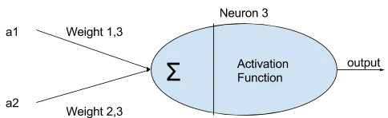
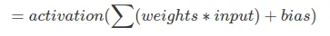
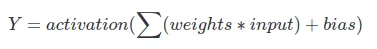
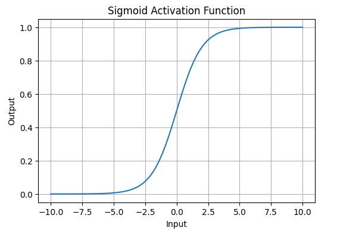
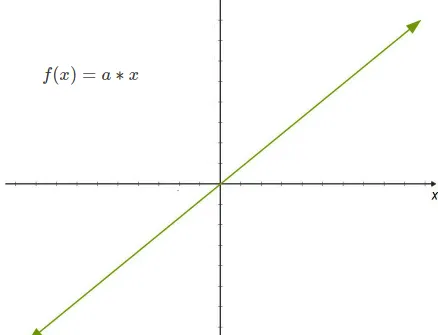
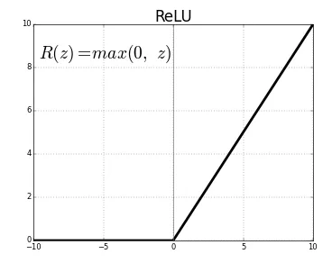

# Activation Functions in Neural Networks

## Activation Function: 
Activation functions are really important for an Artificial Neural Network to learn and make sense of something really complicated and Non-linear complex functional mappings between the inputs and response/output variable. They introduce non-linear properties to the network. Their main purpose is to convert an input signal of a node in an Artificial Neural Network to an output signal. That output signal is used as an input in the next layer in the stack. It is also known as Transfer Function.

An activation function decides whether a neuron should be “fired” or not. Its input is a “weighted sum” of the inputs plus the bias.

The input to the neuron is:
            

The be anything ranging from -inf to +inf. The activation checks the Y value produced by a neuron and decides whether outside connections should consider this neuron as “fired” or not i.e. “activated” or not.

            

## Types Of Activation Function:

There many types of activation function, in here we mainly discuss about 3 types of activation function:
    1. Sigmoid Activation Function
    2. Linear Activation Function
    3. ReLu Activation Function

## 1. Sigmoid Activation Function

Sigmoid Activation Function is characterized by 'S' shape. it is mathematically defined as 
sigmoid(z) = 1 / 1 + e^-z. This formula ensures a smooth and continuous output that is essential for gradient-based optimization methods.

ref: https://www.geeksforgeeks.org/activation-functions-neural-networks/

## Usages
1. Binary Classification values are between (0 and 1).
2. Probability Estimation

## 2. Linear Activation Function
A linear activation function is a function where the output is directly proportional to the input. It is represented as:
            f(x) = a*x;
            

This means the neuron’s output is the same as its input without any transformation.

## Usages
1. Linear activation functions are rarely used in hidden layers because they do not introduce non-linearity to the model.

## 3. ReLu Activation Function
The Rectified Linear Unit (ReLU) is a widely-used activation function in neural networks, particularly in deep learning. It has become the default choice in many architectures due to its simplicity and efficiency. The ReLU function outputs the input directly if it is positive, and outputs zero if the input is negative.

It represent as : 
        R(z) = max(0,z)

        

## Advantages:
1. ReLU function is non-linear, which means we can easily backpropagate the errors and have multiple layers of neurons being activated by the ReLU function.

2. It was found to greatly accelerate the convergence of stochastic gradient descent compared to the sigmoid and tanh functions.

3. It does not activate all the neurons at the same time. Since the output of some neurons is zero, only a few neurons are activated making the network sparse, efficient and easy for computation.
